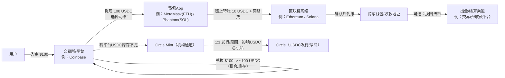
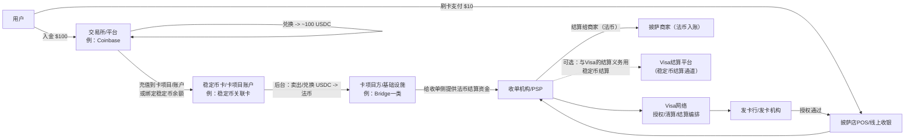

# 稳定币价值链（以 USDC/USDT 等为例）学习笔记

> 目的：把“稳定币从发行到最终支付落地”的参与者、职责与典型路径一次性讲清。

## 1. 一句话总览

- **Circle（以 USDC 为例）**：发行与赎回（mint/burn）的核心机构通道与兑付机制提供方。
- **Coinbase（以及其他交易所/钱包平台）**：面向用户的分发入口、交易撮合与（平台型）托管场景的重要参与者之一。
- **Visa**：支付网络/清算结算的编排者 + 结算层的稳定币接入方 + 出金平台（Visa Direct）的稳定币能力提供方（通常不做发行与赎回，也通常不做面向零售用户的交易所/托管入口）。

> 精确化提示：Coinbase 很关键，但不是唯一分发与托管入口；稳定币的“上链供给变化”发生在发行/赎回（主市场）层面，普通用户在交易所买卖多数属于二级市场（只改变持有人，不一定改变总供给）。

---

## 2. 价值链参与者清单（详细说明 + 一句话解释）

### 2.1 监管与合规框架（Regulators）
- **详细说明**：决定谁能发行/赎回、资金与制裁合规要求、信息披露/审计要求、以及支付/托管的牌照边界。
- **一句话**：监管定义“能做什么、必须怎么做”。

### 2.2 发行方 / 赎回方（Issuer / Redeemer）
- **详细说明**：负责稳定币的 mint/burn、储备与赎回机制（例如 USDC 由 Circle 体系提供发行与赎回通道；普通用户通常不直接触达主市场）。
- **一句话**：发行方负责“供给如何扩张/收缩”的开关。

### 2.3 主市场机构通道（Mint/Redeem Channel）
- **详细说明**：面向合格机构（交易所、做市商、部分金融机构等）的发行/赎回 API/账户体系（例如 Circle Mint 这类）。
- **一句话**：主市场通道把“法币 ↔ 稳定币（链上）”做成可规模化的批发通道。

### 2.4 储备资产管理人 / 托管人 / 现金存放银行（Reserve & Custody）
- **详细说明**：稳定币信用的底座是储备资产与托管安排（现金、短久期国债、回购/货币市场工具等）以及赎回流动性管理。
- **一句话**：储备与托管决定“能不能安全、稳定地 1:1 兑回”。

### 2.5 审计 / 鉴证与披露（Audit / Attestation / Reporting）
- **详细说明**：通过独立审计/鉴证与定期披露降低信息不对称，增强市场信任。
- **一句话**：把“信任”变成可核查的报告。

### 2.6 二级市场：交易所、经纪与做市商（Exchanges / Brokers / Market Makers）
- **详细说明**：大多数用户换到稳定币发生在二级市场（撮合交易、库存/做市提供流动性）。这类交易通常不直接改变稳定币总供给。
- **一句话**：二级市场负责“随时可买卖 + 价格紧贴锚定”。

### 2.7 钱包与托管（Wallets / Custodians）
- **详细说明**：
  - **自托管钱包**：用户自己持有私钥（典型：MetaMask、Phantom 等）。
  - **平台托管**：交易所/钱包App 帮你保管私钥或做账本余额。
- **一句话**：钱包/托管把链上资产变成“可持有、可操作、可风控”的账户体验。

### 2.8 区块链网络与基础设施（L1/L2, Nodes, RPC）
- **详细说明**：稳定币最终跑在链上（例如 Ethereum、Solana 等），链决定费用、确认速度、最终性与可组合性。
- **一句话**：区块链是“资金轨道”。

### 2.9 支付受理与清算结算网络（Acquirers / PSPs / Networks）
- **详细说明**：商户受理侧（收单行/PSP/POS）与网络（如 Visa）负责授权、清算、结算编排；稳定币可在后台用于结算或出金，但商户端常常仍收法币。
- **一句话**：把“链上价值”接到“现实商户资金流”。

### 2.10 出金与平台资金方（Payout Platforms / Employers / Marketplaces）
- **详细说明**：例如 Visa Direct 一类出金平台，可能把稳定币用于预注资或把款直接打到稳定币钱包；资金方决定场景（薪资、创作者分成、跨境收款等）。
- **一句话**：决定“稳定币用在哪些真实业务流里”。

### 2.11 多稳定币发行体系/发行基础设施商（如 Paxos 等）
- **详细说明**：不同稳定币发行体系（USDC、PYUSD、USDG 等）可能通过特定发行基础设施与合规体系进入同一支付/结算网络。
- **一句话**：让网络支持“多币种、多发行体系”的互操作。

---

## 3. 用户视角：100 美元换稳定币 + 10 美元披萨（两条最常见路径）

> 设定：以 **USDC** 为例。

### 3.1 第一步：把 100 美元换成 ~100 USDC（入口阶段）

- 你在交易所/平台（例：Coinbase）入金 100 美元。
- 你用 100 美元买入 USDC：对你而言通常是 **二级市场撮合/平台库存交割**。
- **不必然**因为你这笔交易就触发 Circle 新增发行：只有当平台整体净需求导致 USDC 库存不足时，平台才可能去主市场（例如 Circle Mint）补库存，从而引发 mint（供给变化）。

### 3.2 第二步：你把 USDC 放在哪里（交易所账本 vs 链上钱包）

- **留在平台**：是平台账本里的 USDC 余额（方便交易/支付，但不是自持私钥）。
- **提到链上钱包**：选择链（Ethereum / Solana 等），把 USDC 提现到你控制的地址（自托管钱包如 MetaMask/Phantom）。

### 3.3 第三步：用 USDC 买 10 美元披萨

- **路径 A：链上直付**（商家直接收稳定币）
  - 商家通常通过收款平台（例：Coinbase Commerce / BitPay / Solana Pay 等）生成地址/二维码。
  - 你用钱包在链上转出 10 USDC（外加网络费）给商家。
  - 商家可选择继续持有 USDC 或换回法币。

- **路径 B：稳定币关联卡刷卡**（你用稳定币余额，但商家收法币）
  - 你用“稳定币关联的卡项目”在商户刷卡。
  - 后台由卡项目/基础设施将你的 USDC 兑换成商户要收的本地法币。
  - Visa 负责授权/清算/结算的网络编排；部分机构层结算可能引入稳定币，但对你刷卡体验通常无感。

---

## 4. 流程图（Mermaid）

> 说明：以下为 **Mermaid** 文本流程图。支持 Mermaid 的 Markdown 编辑器/笔记工具可以直接渲染；否则可复制到 Mermaid Live Editor 渲染。

### 图 1：链上直付（商家直接收 USDC）

### 图 2：稳定币卡刷卡（稳定币在后台兑换，商家收法币）

# 附一：Visa 正在开展的稳定币业务（截至 2025-12-16）

> 说明：本附录为“业务线梳理 + 关键合作方 + 进展时间点”的学习总结。日期与表述以 Visa 及相关合作方公开新闻稿/官网披露为准；后续可能随监管与产品进展更新。

## A. 稳定币结算（Settlement）：把稳定币接入 Visa 的清算/结算体系

### A1）做什么
- 让部分 **发卡行（issuer）** 与 **收单行/收单机构（acquirer/PSP）** 可以用稳定币与 Visa 进行结算（相当于把“结算资产”从纯法币扩展到“法币 + 稳定币”）。
- 目标是提升结算可用性（含周末/假日）与资金调度效率，并在传统支付轨与链上资产之间实现互操作。

### A2）支持哪些稳定币与区块链
- 稳定币：**USDC、EURC**（Circle 体系）；以及通过与 Paxos 合作支持的 **PYUSD、USDG**。
- 区块链网络（已披露支持/扩展支持）：**Ethereum、Solana、Stellar、Avalanche**。

### A3）代表性进展（按时间）
- **2023-09**：扩展到收单侧试点，点名 Worldpay、Nuvei；并披露引入 Solana（同时也提到 Ethereum）。
- **2025-07**：披露其结算平台升级为“多币种 + 多链”，新增 Stellar、Avalanche，并引入 EURC、PYUSD、USDG。
- **2025-12-16**：披露在美国推出 USDC 结算；首批参与银行包括 Cross River Bank、Lead Bank，并在 Solana 上开始以 USDC 与 Visa 结算。

### A4）这一条线里 Visa 的位置（一句话）
- **Visa 是结算编排者与接入方**：把稳定币“接入”自身结算体系，让银行/收单伙伴在与 Visa 结算时可选用稳定币。

---

## B. Visa Direct：把稳定币用到“跨境出金/发薪/平台打款”链路

### B1）稳定币预注资（Prefunding）试点
- **做什么**：机构/企业可用稳定币给 Visa Direct 资金池预注资（减少跨境业务对多地法币预备金的依赖）。
- **用户/收款人体验**：收款人一般仍可收本地法币（不要求收款人持有稳定币）。
- **披露时间点**：Visa 在 2025-09 的公开信息中披露该类试点，并提到后续扩展规划。

### B2）稳定币钱包直达出金（Payout to stablecoin wallet）试点
- **做什么**：平台/企业可通过 Visa Direct 把款直接发到收款人的稳定币钱包；资金方可仍以法币出资，收款人选择以 USDC 等稳定币收款。
- **披露时间点**：Visa 在 2025-11 的公开信息中披露该类试点，并提到后续推广规划。

### B3）这一条线里 Visa 的位置（一句话）
- **Visa 是“出金平台能力提供方”**：把稳定币作为资金来源或交付形态嵌入 Visa Direct 的出金链路。

---

## C. VTAP（Visa Tokenized Asset Platform）：面向银行的“法币上链/代币化存款/稳定币”平台

### C1）做什么
- 提供一套面向金融机构的发行、管理与集成能力，覆盖“发行/转移/赎回/生命周期管理”等环节（可用于 tokenized deposits、stablecoins 等）。

### C2）代表性合作方与进展
- Visa 披露 **BBVA** 在 VTAP 沙盒中测试相关能力，并规划后续在公共链（以太坊）上进行试点。

### C3）这一条线里 Visa 的位置（一句话）
- **Visa 是工具/平台提供商**：帮助银行把“法币与存款的链上形态”产品化，而非自己成为发行方。

---

## D. 稳定币关联卡（消费落地）：稳定币余额在后台换成商户所需法币

### D1）做什么
- 用户持有稳定币余额，但在商户侧（通常）仍以法币结算：刷卡时由卡项目/基础设施在后台完成“稳定币 → 法币”的兑换与结算资金提供。

### D2）代表性披露
- 媒体报道 Visa 与 Bridge 推出“稳定币关联 Visa 卡”，其模式核心就是后台把稳定币余额转换为商户需要的本地货币，从而在 Visa 商户网络内可用。

### D3）这一条线里 Visa 的位置（一句话）
- **Visa 是消费受理网络与结算编排者**：让“稳定币资金来源”以卡支付形态无感进入商户受理体系。

---

## E. 稳定币咨询与生态（非交易/非发行）

- Visa 也披露推出稳定币相关咨询能力（教育、落地规划、生态对接），用于帮助机构客户理解与部署稳定币在结算、出金与支付中的用例。

---

## F. 合作伙伴与分工（速查表）

- **Circle**：USDC / EURC 体系（稳定币发行与赎回通道、储备/兑付体系）；也是 Visa USDC 结算能力的重要合作方。
- **Paxos**：Visa 结算平台中对 **PYUSD、USDG** 的支持由其合作引入（发行/合规/基础设施依币种而定）。
- **Worldpay、Nuvei**：收单侧/支付服务商试点伙伴（收单结算链路的一端）。
- **Crypto.com**：早期发行侧试点伙伴之一（与 Visa 结算相关的用例披露）。
- **Cross River Bank、Lead Bank**：Visa 披露的美国 USDC 结算首批银行伙伴。
- **BBVA**：VTAP 试点披露合作银行。
- **Bridge（媒体披露）**：稳定币关联卡的后台基础设施与兑换/结算资金支持。

---

## G. 一句话总结（把 Visa 放回价值链）

- **Visa 不做稳定币发行/赎回**；它主要做三件事：
  1) 把稳定币接入自己的 **结算层（Settlement）**；
  2) 在 **Visa Direct** 里提供“预注资/钱包直达”的稳定币出金能力；
  3) 通过“稳定币关联卡”等形态，让稳定币资金来源在后台完成兑换后进入商户受理网络。

# FAQ（持续更新）

## Q1：从“货币创造与销毁”的角度，Circle 像央行、Coinbase 像商业银行吗？

结论：这个类比有启发性，但不能直接等同；更准确的理解是“Circle 控制 USDC 的 mint/burn（供给变化），Coinbase 多数时候提供二级市场分发/交易/托管入口（改变持有人，不一定改变总供给）”。

**相似点**
- USDC 总量的扩张/收缩，确实对应“发行（mint）/赎回销毁（burn）”这一套机制；从宏观视角看有点像“供给开关”。
- Coinbase 等平台面向用户提供“买卖、持有、转账、提现到链上”等入口体验，外观上像“账户入口”。

**关键差异**
- Circle 不是央行：它不发行法币、也不做货币政策；USDC 更像“可按 1:1 兑回的私人负债/凭证”，供给扩张通常需要先进入等额准备金。
- Coinbase 通常不是商业银行：其核心是交易撮合/托管与出入金通道，不等同于“通过放贷创造存款”的信用创造机制。
- 主市场 vs 二级市场不同：Circle mint/burn 属于主市场（影响总供给）；你在 Coinbase 买卖多数是二级市场（主要改变持有人）。
- 风险与保障不同：平台余额/托管资产一般不等同于受存款保险保护的银行存款（是否受保护取决于司法辖区与具体产品结构）。

**更贴近的类比**
- Circle：更像“100%准备金的稳定币发行人 + 赎回结算代理（把美元代币化）”。
- Coinbase：更像“交易所/券商 + 托管人 + 零售入口（必要时连接主市场补库存）”。

备注：后续有更多问题可继续追加到本 FAQ。
